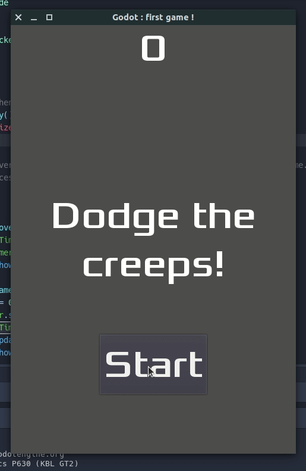

= godot-engine-first-game

First game using the godot engine

== Introduction

This is the implementation of the step by step tutorial of Godot Engine to create a first game : https://docs.godotengine.org/en/stable/getting_started/step_by_step/your_first_game.html

== Run the game

Open the project in the Godot Game Engine editor and play the project (default shortcut is F5).

The game was made with Godot 3.2.1, and is using the GLES 3 renderer.

== Try the game

The game should be available at https://fboulay.github.io/godot-engine-first-game/

== Development

Each commit should a playable game. I try to add new features on each commit just for fun

Here is a small screencast of what the game looks like.

== Licence

MIT licence